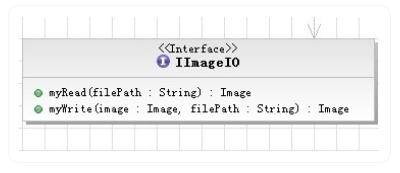
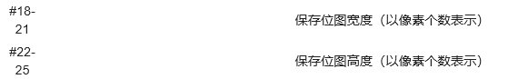
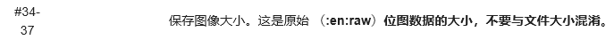

# ImageProcessing

海明皓 17343037

## 实验简介

​	本实验要求利用本实验软装置，实现一个利用二进制流读取Bitmap图像，并且能够进行简单地处理和保存的软件。

## IImageIO的实现

​	我们需要实现的函数有两个，一个是位图的读取，另外一个是位图的写入，如下所示：



​	在读取的时候，我们采用二进制流的方式，位图前54个字节保存了有关位图的相关信息，我们找到一些关键的信息：

​	

​	

​	我们需要从这些对应的字节中提取出信息，我们创建了一个getMessage的函数：

```java
/*
	get message from bitmap message
*/
private int getMessage(byte[] message, int start, int length)
{
    int result = 0;
    for (int i = 0; i < length; ++ i)
    {
        result = result | ((message[start + i] & 0xff) << 8 * i);
    }
    return result;
}
```

​	因为我们是按照byte进行存储的：

```java
byte message[] = new byte[LENGTH];
istream.read(message, 0, LENGTH);
```

​	在JAVA中，byte是八位带符号的二进制数，此处四个byte组成了一个32位的数字，如果我们直接使用移位和与操作进行组合的话，由于byte最高位是符号位，移位的过程中，负数由于是通过补码表示的，高位会补1，这是为了保持十进制的一致性，但是在我们读取位图的时候，我们关心的是其二进制补码的一致性，需要将其高24位置0，保持低8位，所以我们利用和0xff相与的操作来实现这一点。

​	相与之后，我们再进行移位、组合，就可以得到这四个字节表示的信息了：

```java
// get width, height and size from bitmap
int width = getMessage(message, 18, 4);
int height = getMessage(message, 22, 4);
int size = getMessage(message, 34, 4);
```

​	另外，我们还需要关注位图数据的保存方式：像素是从下到上、从左到右保存的。每个像素使用一个或者多个字节表示。如果一个图像水平线的字节数不是4的倍数，这行就使用空字节补齐，通常是ASCII码0。

​	比如，有一张5*5的图片，应该会有25个pixels，但是因为5不是4的倍数所以会显示成：

xxxxx000 xxxxx000 xxxxx000 xxxxx000 xxxxx000

​	所以我们需要先计算出每行中空位的多少：

```java
int emptyNum = (size / 3) / height - width;
```

​	在读取的过程中，我们保持从下到上、从左到右的顺序进行读取：

```java
// from bottom to top
for (int i = height - 1; i >= 0; -- i)
{
    // from left to right
    for (int j = 0; j < width; ++ j)
    {
        temp[i * width + j] = (int)((store[index] & 0xff) | ((store[index + 1] & 0xff) << 8) | ((store[index + 2] & 0xff) << 16) | (0xff << 24));
        index += 3;
    }
    // ignore the empty pixel
    index += emptyNum * 3;
}
```

​	由于每个条目包含了四个字节，其中三个表示红色、绿色和蓝色，第四个字节没有使用（大多数应用程序将它设为0），所以我们还是通过和0xff相与之后进行移位组合的方式获取像素信息，要注意每行读取完成之后，要加上3倍的空位数量（空位也有三个字节）。

​	保存图像的时候，由于可以使用BufferedImage方法，所以其实现就比较简单了，主要是将图片保存进bufferImg中再将其写出：

```java
File file = new File(filePath + ".bmp");
// create bufferImg
BufferedImage bufferImg = new BufferedImage(image.getWidth(null), image.getHeight(null), BufferedImage.TYPE_INT_RGB);
// put image into bufferImg
bufferImg.getGraphics().drawImage(image, 0, 0, null);
// write bufferImg into file
ImageIO.write(bufferImg, "bmp", file);
```

## IImageProcessor的实现

​	IImageProcessor的实现比较容易，主要是提取出红色、绿色、蓝色三个通道以及转换成灰度图像，在CV的作业中也有涉及，是利用了CImg来实现的，这里我们只需要调用getRed等函数来提取相对应的颜色就可以了：

​	我们根据不同的情况，也就是choice的值，对图像进行不同的操作：

```java
for (int i = 0; i < image.getWidth(); ++ i)
{
    for (int j = 0; j < image.getHeight(); ++ j)
    {
        Color color = new Color(image.getRGB(i, j));
        switch(choice)
        {
            case 0:
                image.setRGB(i, j, new Color(color.getRed(), 0, 0).getRGB());
                break;

            case 1:
                image.setRGB(i, j, new Color(0, color.getGreen(), 0).getRGB());
                break;

            case 2:
                image.setRGB(i, j, new Color(0, 0, color.getBlue()).getRGB());
                break;

            default:
                image.setRGB(i, j, new Color(getGray(color), getGray(color), getGray(color)).getRGB());
                break;
        }
    }
}
```

​	灰度图像的转换过程，我们利用到的公式为：
$$
I = 0.299 * R + 0.587 * G + 0.114 *B
$$
​	其中R,G,B分别为红、绿、蓝通道的颜色值。

