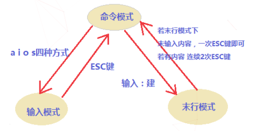
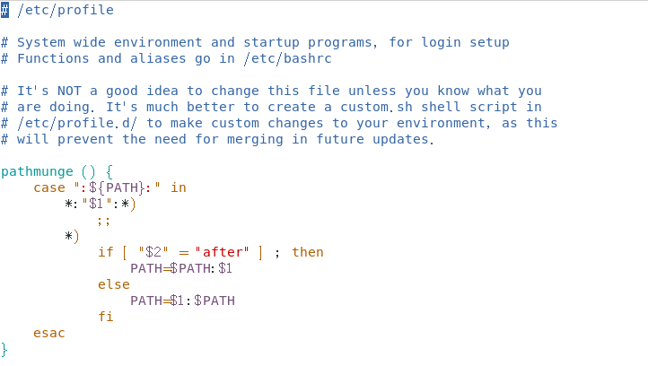
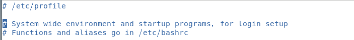
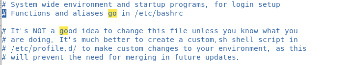
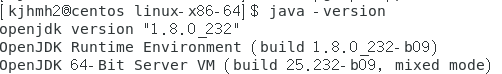
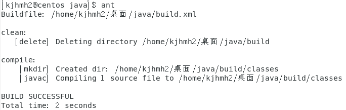
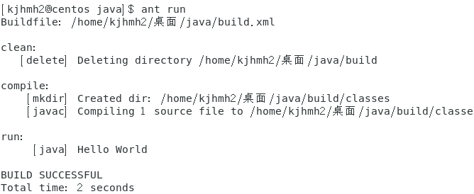
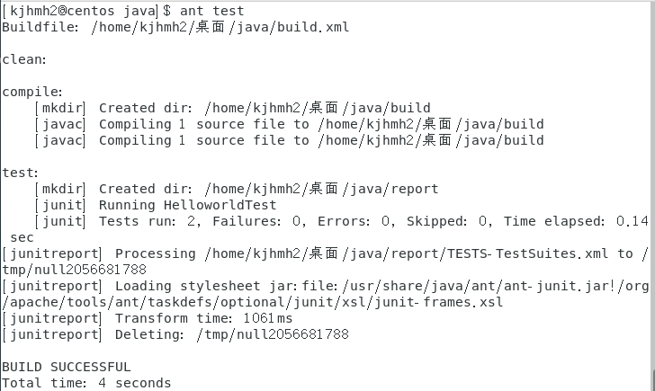
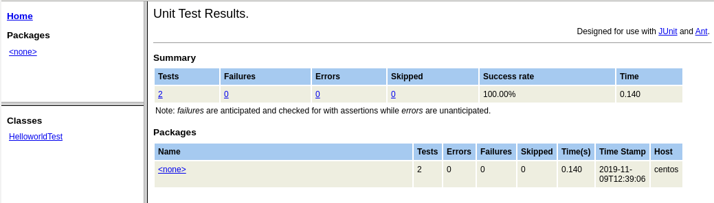

# 自学报告

海明皓 17343037

### vi/vim编辑器的使用

vi编辑器是所有Unix及Linux系统下标准的编辑器，vi是Visual Interface的缩写，即 可视化接口，vim是vi iMprove的缩写，即vi的增强版，具有语法着色的功能

- 模式切换

  vim编辑器包括三种模式：命令模式、输入模式和末行模式：

  - 命令模式（默认)：刚进入vim的时候，默认就是命令模式，可以复制行，删除行等
  - 输入模式：可以输入内容
  - 末行模式：在最下边，除编辑模式，可以输入诸多管理员命令

  三种模式之间的切换方式如下：

  - 命令模式→输入模式：

    i：在当前光标所在字符的前面，转为输入模式

    I：在当前光标所在行的行首转换为输入模式

    a：在当前光标所在字符的后面，转为输入模式

    A：在光标所在行的行尾，转换为输入模式

    o：在当前光标所在行的下方，新建一行，并转为输入模式

    O：在当前光标所在行的上方，新建一行，并转为输入模式

    s：删除光标所在字符

    r：替换光标处字符

  - 输入模式→命令模式

    ESC键

  - 末行模式→命令模式

    ESC键

  - 命令模式→末行模式

    输入：即可转为末行模式

  可用图表示成如下的样子：

  

- 打开文件

  - `vim /path/to/somefile` ：vim后跟文件路径及文件名 ，如果文件存在，则打开编辑文件窗口，如果文件不存在，则创建文件

    ```bash
    # vim /etc/profile
    ```

    

  - `vim + #` ：打开文件，并定位到第#行，#代表数字

    ```bash
    # vim +3 /etc/profile
    ```

    

  - `vim +`： 打开文件，定位到最后一行

    ```bash
    # vim + /etc/profile
    ```

    

  - `vim +/PATTERN`：打开文件，定位到第一次被PATTERN匹配到的行的行首，这里的PATTERN是单词`go`

    ```bash
    # vim +/go /etc/profile
    ```

    

- 关闭文件

  - 末行模式下

    w：保存

    q：退出

    wq 或 x：保存退出

    q！：强制退出

    w！：强制保存，需要管理员权限

  - 命令模式下

    zz：保存并退出

- 删除字符

  - x：删除光标所在处单个字符

  - #x：删除光标所在处及向后共#个字符

    *d命令跟 跳转命令组合使用 如：dw 表示删除光标所在位置到下一个单词词首所有字符*

    #dw，#de，#db ：#dw表示 删除当前光标所在处及向后第#个单词词首所有字符 

  - dd：删除当前光标所在行

  - #dd：删除包含当前光标所在行内的#行

- 撤销编辑

  可以通过u或#u撤回一次或多次操作，也可以使用Ctrl+r

- 移动光标

  - 逐字符移动

    h：向左, l：向右, j：向下, k：向上

  - 以单词为单位移动

    w：移到下一个单词的词首

    e：跳至当前或下一个单词的词尾

    b：跳至当前或上一个单词的词首

  - 行内跳转

    0：绝对行首

    ^：行首第一个非空白字符

    $：绝对行尾

以上这些就是平时日常所用到的指令和操作方法，如果需要一些复杂的指令的话随时可以去官方文档中查询，vim编辑器讲究熟能生巧，用得多了，自然会记住这些日常常用的指令，编写文件或程序也就会得心应手。

### JAVA学习

- JDK的配置

  从官网下载JDK之后，设置好环境变量即可，可通过如下命令：

  ```bash
  java -version
  ```

  查看自己的版本号：

  

- Helloworld

  我们编写一个简单的`Helloworld`程序，如下所示：

  ```java
  public class Helloworld {
      public static void main(String[] args) {
          System.out.println("Hello World");
      }
  }
  ```

  保存命令成`Helloworld.java`，要注意类名和文件名需要一致

  通过如下命令进行编译运行：

  ```bash
  javac Helloworld.java
  java Helloworld
  ```

  我们可以看到输出为：

  

- 主要特点概述

  - 跨平台/可移植性

    ​	这是Java的核心优势，Java语言在设计时就很注重移植和跨平台性，比如Java的int类型永远都是32位，不像C++可能是16位或者32位，这样的话程序的移植就会非常麻烦。

  - 安全性

    ​	Java适合于网络/分布式环境，为了达到这个目标，在安全性方面投入了很大的精力。Java可以很容易构建防病毒，防篡改的系统。

  - 面向对象

    ​	C++为了照顾大量C语言使用者，其还兼容了C语言，使得自身成为了带类的C语言，或多或少影响了其面向对象的彻底性，而Java则是完全的面向对象语言。

  - 高性能

    ​	Java语言本身发展中通过虚拟机的优化提升了几十倍运行效率。比如，通过JIT(JUST IN TIME)即时编译技术提高运行效率。 将一些热点字节码编译成本地机器码，并将结果缓存起来，在需要的时候重新调用，这样的话，使Java程序的执行效率大大提高，某些代码甚至接待C++的效率。

  - 分布式

    ​	 Java是为Internet的分布式环境设计的，因为它能够处理TCP/IP协议。事实上，通过URL访问一个网络资源和访问本地文件是一样简单的。Java还支持远程方法调用，使程序能够通过网络调用方法。

  - 多线程

    ​	Java多线程的简单性是Java成为主流服务器端开发语言的主要原因之一，多线程的使用可以带来更好的交互响应和实时行为。

- 和C++的区别

  - 关键字

    ​	在关键字上，JAVA和C++在一些关键字上也有不同，比如继承的时候JAVA使用的extends而C++直接使用：进行声明，JAVA常量用final而C++是使用const等。C++里面的string类型是都为小写，布尔变量的类型是bool，而在JAVA里面则是使用String和boolean来分别表示这两种类型。

    ​	在表示父类的时候，JAVA引入了super这个关键字，这就使得如果子类重写了父类的函数，仍然可以使用super来调用父类的函数。在给类的成员函数和对象定义的时候，C++只用public：即可代表下面所有的都是public类型，而JAVA则不然，需要每个都进行一次定义。

  - 程序文件

    ​	C++的程序代码一般是放在.cpp文件或者.h的头文件里，而JAVA的一个程序则是打包成一个文件夹，不同的类、接口必须放在不同的文件里面，整个组合起来，成为一个程序的文件。

    ​	在引用一些函数库的时候，C++是使用#include..来进行应用而JAVA则是通过import java..来以包的形式进行导入。

  - 继承与指针

    ​	在继承上，C++的类可以继承多个父类，也就是多继承，但是JAVA只能继承一个父类，也就是单继承。在指针上，C++里面是支持指针的，而JAVA则是摒弃了复杂的指针。

  - 异常处理

    ​	C++的异常处理一般是直接在会出现错误的地方直接进行try和catch的处理，而JAVA则是可以通过一级一级向上抛出异常，在一个特定的类里面同时处理所有的异常，这样的优点是能够使得整个程序更加系统地处理，也更加便于维护

  - 主函数

    ​	在C++中，main函数的声明通常是int main(void)这样的形式，而在JAVA里面则是public static void main(String[] args)这样的形式，在命令提示符中运行这个程序的时候，可以附加参数，参数则会储存到args这个数组里面。如果不写String[] args，程序则会运行错误。

### Ant环境

- 安装与部署

  可以直接执行如下命令安装：

  ```bash
  sudo yum install ant
  ```

  也可以在网上找相关的包，配置环境变量

  可以看到我们的版本号如下：

  

- Ant说明

  Ant类似于是C++中的Makefile，方便程序员去编译实现并测试，Ant的构建文件是基于XML编写的，默认名称为build.xml。

  - project

    - project元素是Ant构件文件的根元素，Ant构件文件至少应该包含一个project元素，否则会发生错误。在每个project元素下，可包含多个target元素。以下是project元素的各属性。
      - name：用于指定project元素的名称
      - default：用于指定project默认执行时所执行的target的名称
      - basedir：用于指定基路径的位置。该属性没有指定时，使用Ant的构件文件的附目录作为基准目录

  - target
    target是Ant的基本执行单元，它可以包含一个或多个具体的任务。多个target可以存在相互依赖关系，具有如下属性：

    - name：指定target元素的名称，这个属性在一个project元素中是唯一的，我们可以通过指定target元素的名称来指定某个target。
    - depends：用于描述target之间的依赖关系，若与多个target存在依赖关系时，需要以“,”间隔。Ant会依照depends属性中target出现的顺序依次执行每个target。被依赖的target会先执行。
    - if：用于验证指定的属性是否存在，若不存在，所在target将不会被执行。
    - unless：该属性的功能与if属性的功能正好相反，它也用于验证指定的属性是否存在，若不存在，所在target将会被执行。
    - description：该属性是关于target功能的简短描述和说明。

  - property

    ​	该元素可看作参量或者参数的定义，project的属性可以通过property元素来设 定，也可在Ant之外设定。

    ​	property元素可用作task的属性值。在task中是通过将属性名放在“${”和“}”之间，并放在task属性值的位置来实现的。

- 使用ant自动编译运行java程序

  我们创建一个java文件夹，文件目录为：

  ```
  ├── build.xml
  └── src
      └── Helloworld.java
  ```

  build.xml的实现如下所示：

  ```xml
  <?xml version="1.0"?>
  <project name="java" default="compile" basedir=".">
  	<target name="clean">
  		<delete dir="build"/>
  	</target>
  	<target name="compile" depends="clean">
  		<mkdir dir="build/classes"/>
  		<javac srcdir="src" destdir="build/classes" includeAntRuntime="false"/>
  	</target>
  	<target name="run" depends="compile">
  		<java classname="Helloworld">
  			<classpath>
  				<pathelement path="build/classes"/>
  			</classpath>
  		</java>
  	</target>
  </project>
  ```

  运行`ant`命令，即可实现文件的自动编译：

  

  运行`ant run`命令，即可实现文件的编译运行：

  

  可以看到输出了Hello World

### Junit

- 概述

  ​	Junit是一个Java语言的单元测试框架，主要用于项目的单元测试，其允许程序员使用`@Test`来描述测试的数据。我们可以使用`assertEquals()`对输出结果进行判定。如果符合预期输出，则输出true，否则报错。使用 Junit 不需要创建 main()方法，而且每个测试方法一一对应，逻辑特别清晰。

  ​	主要的逻辑是：

  - @Test: 测试方法
  - @Ignore: 被忽略的测试方法，加上之后暂时不运行此段代码
  - @Before: 每一个测试方法之前运行
  - @After: 每一个测试方法之后运行
  - @BeforeClass: 方法必须必须要是静态方法，所有测试开始之前运行
  - @AfterClass: 方法必须要是静态方法，所有测试结束之后运行

  ​	其编写测试类的原则是：

  - 测试方法上必须使用@Test进行修饰
  - 测试方法必须使用public void 进行修饰，不能带任何的参数
  - 测试类所在的包名应该和被测试类所在的包名保持一致
  - 测试单元中的每个方法必须可以独立测试，测试方法间不能有任何的依赖
  - 测试类使用Test作为类名的后缀（非必须）
  - 测试方法使用test作为方法名的前缀（非必须）

- 对`Helloworld`进行测试：

  首先我们修改一下原本的`Helloworld`类的实现：

  ```java
  import java.util.*;
  public class Helloworld {
      String str;
      public void hello() {
          str = "Hello World";
      }
      public String getStr() {
          return str;
      }
      public static void main(String[] args) {
          System.out.println("Hello World");
      }
  }
  ```

  进行测试类`HelloWorldTest`的编写：

  ```java
  import static org.junit.Assert.*;
  import org.junit.Test;
  
  public class HelloWorldTest {
      public Helloworld helloworld = new Helloworld();
      @Test
      public void testHello() {
          helloworld.hello();
          assertEquals("Hello World", helloworld.getStr());
      }
      @Test
      public void testHello2() {
          helloworld.hello();
          assertEquals("Hello World", helloworld.getStr());
      }
  }
  ```

  重新修改一下我们的build.xml，使得ant可以利用Junit对我们的程序进行测试：

  ```xml
  <?xml version="1.0"?>
  <project name="java" default="compile" basedir=".">
  	<!-- 源代码路径 -->
      <property name="src.path" value="src/java"/>
      <!-- 编译文件路径 -->
      <property name="build.path" value="build"/>
      <!-- 测试代码路径 -->
      <property name="test.path" value="src/test"/>
      <!-- junit包路径 -->
      <property name="lib.path" value="lib"/>
      <!-- report路径 -->
      <property name="report.path" value="report"/>
  
  	<!-- 设置classpath -->
      <path id="compile.path">
          <fileset dir="${lib.path}">
              <include name="**/*.jar"/>
          </fileset>
          <pathelement path="${build.path}"/>
      </path>
  	
  	<!-- 编译测试文件，初始化build目录 -->
      <target name="compile" depends="clean">
          <mkdir dir="${build.path}"/>
          <javac srcdir="${src.path}" destdir="${build.path}"  classpathref="compile.path" includeantruntime="on"/>
          <javac srcdir="${test.path}" destdir="${build.path}"  classpathref="compile.path" includeantruntime="on"/>
      </target>
  
  	<!-- 运行 -->
  	<target name="run" depends="compile">
  		<java classname="Helloworld">
  			<classpath>
  				<pathelement path="${build.path}"/>
  			</classpath>
  		</java>
  	</target>
  
  	<!-- 执行测试 -->
      <target name="test" depends="compile">
  	    <mkdir dir="${report.path}"/>
      	<junit printsummary="true">
      		<formatter type="xml" usefile="true"/>
        		<classpath refid="compile.path"/>
               <test name="HelloworldTest" todir="${report.path}"/>
          </junit>
          <junitreport todir="${report.path}">
              <fileset dir="${report.path}" includes="TEST-*.xml">
              </fileset>
              <report format="frames" todir="${report.path}/html"/>
          </junitreport>
      </target>
  
  	<!-- 清除历史编译和报告 -->
      <target name="clean">
          <delete dir="${build.path}"/>
  		<delete dir="${report.path}"/>
      </target>
  
  </project>
  ```

  开始之间，整个文件的目录结构如下：

  ```
  ├── build.xml
  ├── lib
  │   └── junit-4.12.jar
  └── src
      ├── java
      │   └── Helloworld.java
      └── test
          └── HelloworldTest.java
  ```

  我们使用命令`ant test`进行测试，结果如下所示：

  

  我们在目录report/html中打开index.html文件，可以看到测试结果：

  

### 总结

​	今天的实训结束了，还是蛮有收获，之前也有选Java的专选，可能入门会稍微快一点，也帮助我捡起了一点之前学过的内容；今天在配环境的时候也学习到了很多Linux的操作，Ant和Junit也算是搞懂了一些基本的用法，能够完成一个非常简单的测试项目。


